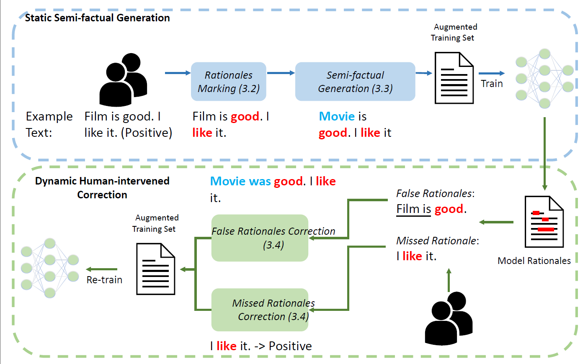

# A Rationale-Centric Framework for Human-in-the-loop Machine Learning (ACL2022)

This repository is associated with the paper [A Rationale-Centric Framework for Human-in-the-loop Machine Learning](https://arxiv.org/abs/2203.12918) (Accepted to the main conference of ACL2022)

## Usage

### Dependencies
Tested Python 3.6, and requiring the following packages, which are available via PIP:

* Required: [numpy >= 1.19.5](http://www.numpy.org/)
* Required: [scikit-learn >= 0.21.1](http://scikit-learn.org/stable/)
* Required: [pandas >= 1.1.5](https://pandas.pydata.org/)
* Required: [torch >= 1.9.0](https://pytorch.org/)
* Required: [transformers >= 4.8.2](https://huggingface.co/transformers/)
* Required: [datasets>=1.14.0](https://huggingface.co/docs/datasets/index)
* Required: [nltk>=3.6.5](https://www.nltk.org/)

### Top-level directory layout

    .
    ├── datasets                   # IMDb datasets, human labelled rationales, counterfactuals examples (Hovy et al.)
    ├── AL_results                 # Experimental outputs of baseline active learning
    ├── DP_results                 # Experimental outputs of baseline duplication
    ├── RR_results                 # Experimental outputs of baseline random replacement
    ├── MR_results                 # Experimental outputs of baseline missing rationales
    ├── FR_results                 # Experimental outputs of baseline false rationales
    ├── SF_results                 # Experimental outputs of our approach static semi-factuals
    ├── full_results               # Experimental outputs of baseline training with the full training set
    ├── Hybrid_results             # Experimental outputs of our approach dynamic human-intervened correction
    └── README.md
 
 
### Preliminaries

1. For running the code, you should add some code in trainer.py (as shown below) under the transformers directory (in my device on ~/Anaconda3/Lib/site-packages/transformers/trainer.py):

2. Random sampling a certain number (25 in our experiments) of positives and negatives storing in AL_results/AL_step0_IMDb_trainer_{seed}_ {num_instances_each_class}/keys.txt

3. Please run scripts with step0 first, then go to __IMDb_AL_example_selection_step1.ipynb__ to extract another 50 examples from the unlabelled pool according to uncertainty sampling. Then can run scripts with step1.

### Generate static semi-factual augmented examples by replacing non-rationales

See _static_semi_factual_generation.ipynb_ 

### Generate false rationales augmented data

Run _IMDb_step1_generate_false_rationales_position.py_
Then see _IMDb_generate_false_rationales_examples.ipynb_

### Generate missing rationales augmented data

Run _IMDb_step1_generate_missing_rationales_examples.py_

